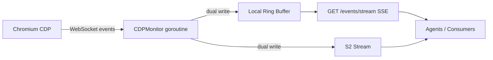

# RFC: Browser Event Capture

## Summary

Add a configurable browser event streaming system to the image server that captures CDP events (console, network, DOM, layout shifts, screenshots, interactions), tags them with tab/frame context, and durably writes them to S2 streams for near-real-time multi-consumer access. Events are also available locally via an SSE endpoint.

## Motivation

Browser agents need real-time observability into what the browser is doing: console output, network traffic, DOM changes, navigation, layout shifts, and user interactions. Today there is no structured event stream from the image server. Agents rely on polling screenshots or manual CDP connections.

This system provides:

1. **Fine-grained, configurable capture** -- choose exactly which event categories to record, with per-category options (e.g., network with or without response bodies).
2. **Tab/iframe awareness** -- every event is tagged with target ID, session ID, and frame ID so consumers can distinguish events from different tabs and iframes.
3. **Smart waiting signals** -- computed meta-events (`network_idle`, `layout_settled`, `navigation_settled`) that are strictly more informative than Playwright's `networkidle` or `domcontentloaded`, enabling smarter wait strategies.
4. **Durable streaming via S2** -- events are written to an S2 stream for multi-consumer near-real-time access.

## Architecture



The CDPMonitor opens its own CDP WebSocket to Chrome (using the existing `UpstreamManager.Current()` URL) and subscribes to configured CDP domains. It normalizes events into a common schema, tags each with tab/frame/target context, and dual-writes to both an S2 stream and a local ring buffer. The local buffer backs a `GET /events/stream` SSE endpoint.

Default state is **off**. An explicit `POST /events/start` is required to begin capture.

## CDP Library Choice

Raw `coder/websocket` (already in `go.mod`). The protocol is just JSON-RPC over WebSocket: send `{id, method, params}`, receive events `{method, params, sessionId}` and responses `{id, result/error}`. This is the same approach the existing devtools proxy uses (`server/lib/devtoolsproxy/proxy.go`). No need for chromedp's abstraction layer since we're tapping events, not driving the browser.

Reference protocol definitions are in `./devtools-protocol/` (cloned from [ChromeDevTools/devtools-protocol](https://github.com/ChromeDevTools/devtools-protocol)).

## Event Schema

Each event is a JSON record, capped at **1MB** (S2's record size limit):

```go
type BrowserEvent struct {
    Timestamp     int64           `json:"ts"`                        // unix millis
    Type          string          `json:"type"`                      // snake_case event name
    TargetID      string          `json:"target_id,omitempty"`       // CDP target ID (tab/window)
    SessionID     string          `json:"session_id,omitempty"`      // CDP session ID
    FrameID       string          `json:"frame_id,omitempty"`        // CDP frame ID
    ParentFrameID string          `json:"parent_frame_id,omitempty"` // non-empty = iframe
    URL           string          `json:"url,omitempty"`             // URL context
    Data          json.RawMessage `json:"data"`                      // event-specific payload
    Truncated     bool            `json:"truncated,omitempty"`       // true if payload was cut to fit 1MB
}
```

### Event Types

**Raw CDP events** (forwarded from Chrome, enriched with target/frame context):

| Type | CDP Source | Key Fields in `data` |
|------|-----------|---------------------|
| `console_log` | Runtime.consoleAPICalled | level, text, args, stack_trace |
| `console_error` | Runtime.exceptionThrown | text, line, column, url, stack_trace |
| `network_request` | Network.requestWillBeSent | method, url, headers, post_data, resource_type, initiator |
| `network_response` | Network.responseReceived + getResponseBody | status, status_text, url, headers, mime_type, timing, body (truncated at ~900KB) |
| `network_loading_failed` | Network.loadingFailed | url, error_text, canceled |
| `navigation` | Page.frameNavigated | url, frame_id, parent_frame_id |
| `dom_content_loaded` | Page.domContentEventFired | — |
| `page_load` | Page.loadEventFired | — |
| `dom_updated` | DOM.documentUpdated | — |
| `target_created` | Target.targetCreated | target_id, url, type |
| `target_destroyed` | Target.targetDestroyed | target_id |
| `interaction_click` | Injected JS | x, y, selector, tag, text |
| `interaction_key` | Injected JS | key, selector, tag |
| `interaction_scroll` | Injected JS | from_x, from_y, to_x, to_y, target_selector |
| `layout_shift` | Injected PerformanceObserver | score, sources (element, previous_rect, current_rect) |
| `screenshot` | ffmpeg x11grab (full display) | base64 PNG in data |

**Computed meta-events** (emitted by the monitor's settling logic):

| Type | Trigger |
|------|---------|
| `network_idle` | Pending request count at 0 for 500ms after navigation |
| `layout_settled` | 1s of no layout-shift entries after page_load (timer resets on each shift) |
| `scroll_settled` | No scroll events for 300ms with >5px movement |
| `navigation_settled` | `dom_content_loaded` AND `network_idle` AND `layout_settled` all fired |

### How Computed Events Work

**`network_idle`**: Counter incremented on `Network.requestWillBeSent`, decremented on `Network.loadingFinished` / `Network.loadingFailed`. After `Page.frameNavigated`, when counter hits 0, start a 500ms timer. If no new requests arrive in 500ms, emit `network_idle`. Reset on next navigation.

**`layout_settled`**: After `Page.loadEventFired`, inject a [`PerformanceObserver`](https://developer.mozilla.org/en-US/docs/Web/API/PerformanceObserver) watching for [`layout-shift`](https://developer.mozilla.org/en-US/docs/Web/API/LayoutShift) entries. This is a browser API that fires whenever visible elements move position without user input (e.g., an image loads and pushes text down, a font swap changes line heights, lazy content appears). Each shift entry has a `value` (0-1 score) and `sources` (which DOM nodes moved, from/to rects). Poll via `Runtime.evaluate` every 500ms. After `page_load`, start a 1s timer. Each time a layout shift is detected, reset the timer. When the timer expires (1s of quiet), emit `layout_settled`. For pages with zero layout shifts, this fires 1s after page_load. This captures visual stability that neither `networkidle` nor `domcontentloaded` can detect.

**`scroll_settled`**: The injected interaction tracking JS coalesces scroll events with a 300ms debounce. When scrolling stops for 300ms with >5px total movement, emit `scroll_settled`.

**`navigation_settled`**: Composite signal. After a navigation, track three booleans: `dom_content_loaded_fired`, `network_idle_fired`, `layout_settled_fired`. When all three are true, emit `navigation_settled`. This is strictly more informative than Playwright's `networkidle` or `domcontentloaded` because it also waits for visual stability.

## API Endpoints

Consistent with existing prefix pattern (`/recording/`, `/process/`, `/computer/`, `/fs/`, etc.):

### `POST /events/start`

Start event capture. Takes config body. If already running, reconfigures on the fly. Returns 200.

```json
{
  "console": true,
  "network": true,
  "network_response_body": true,
  "navigation": true,
  "dom": true,
  "layout_shifts": true,
  "screenshots": true,
  "screenshot_triggers": ["error", "navigation_settled"],
  "targets": true,
  "interactions": true,
  "computed_events": true
}
```

All fields default to `false`. A minimal call:

```json
{ "network": true }
```

### `POST /events/stop`

Stop event capture. Returns 200.

### `GET /events/stream`

SSE stream of events from local ring buffer. Returns `text/event-stream`. Each SSE `data:` line is one `BrowserEvent` JSON.

### Config Schema

```yaml
EventCaptureConfig:
  type: object
  properties:
    console:
      type: boolean
      description: Capture console logs and exceptions
    network:
      type: boolean
      description: Capture network requests and responses
    network_response_body:
      type: boolean
      description: Include response bodies (up to ~900KB, truncated beyond). Requires network=true
    navigation:
      type: boolean
      description: Capture page navigation and load events
    dom:
      type: boolean
      description: Capture DOM update events
    layout_shifts:
      type: boolean
      description: Inject PerformanceObserver for layout shift detection
    screenshots:
      type: boolean
      description: Capture full-display screenshots at key moments
    screenshot_triggers:
      type: array
      items:
        type: string
        enum: [error, page_load, navigation_settled, scroll_settled, network_idle]
      description: Which events trigger a screenshot. Default [error, navigation_settled]
    targets:
      type: boolean
      description: Capture target (tab/window) creation/destruction
    interactions:
      type: boolean
      description: Inject JS to track clicks, keys, scrolls
    computed_events:
      type: boolean
      description: Emit computed meta-events (network_idle, layout_settled, scroll_settled, navigation_settled)
```

## Multi-Target via setAutoAttach

To monitor all tabs and iframes, the monitor calls `Target.setAutoAttach` with `{autoAttach: true, waitForDebuggerOnStart: false, flatten: true}` on the browser-level CDP session. With `flatten: true`, all events from child targets arrive on the same WebSocket connection annotated with `sessionId`. The monitor maintains a `sessionId -> targetInfo` map (populated from `Target.targetCreated` / `Target.attachedToTarget` events) to enrich each event with target context (URL, type, targetId).

## Screenshots

Full-display screenshots using the existing ffmpeg x11grab approach (same as `TakeScreenshot` in `computer.go`). The PNG is base64-encoded and placed in the event `data` field. A typical 1920x1080 PNG screenshot is ~200-500KB base64, well under the 1MB S2 limit. If a screenshot exceeds ~950KB base64 (e.g., unusually complex screen content), downscale the image by halving dimensions and re-encode before embedding. This keeps the event under S2's 1MB record limit while preserving a usable PNG (never truncate binary data). Screenshots are triggered by configurable events (default: `error`, `navigation_settled`).

## S2 Integration

- **New dependency**: `github.com/s2-streamstore/s2-sdk-go` (v0.11.8, same as kernel repo)
- **Config env vars** (in `server/cmd/config/config.go`):
  - `S2_ACCESS_TOKEN` -- S2 access token (optional; if absent, S2 writes are skipped)
  - `S2_BASIN` -- S2 basin name
  - `S2_STREAM_NAME` -- stream name for browser events
- **Write path**: CDPMonitor batches events (every 100ms or 50 events, whichever comes first) and calls `streamClient.Append()` with `[]AppendRecord`. Each record body is the JSON-serialized `BrowserEvent`.
- **Graceful degradation**: If S2 config is not provided, dual-write only goes to local buffer. SSE still works.

## Files to Create / Modify

### New Files

| File | Purpose |
|------|---------|
| `server/lib/cdpmonitor/monitor.go` | Core: raw coder/websocket CDP client, domain enablement, setAutoAttach, event dispatch loop |
| `server/lib/cdpmonitor/events.go` | BrowserEvent struct, event type constants, JSON serialization, 1MB truncation |
| `server/lib/cdpmonitor/config.go` | EventCaptureConfig struct, validation, reconfiguration |
| `server/lib/cdpmonitor/settling.go` | Network idle state machine, layout shift observer injection/polling, composite navigation_settled |
| `server/lib/cdpmonitor/interactions.go` | JS injection for click/key/scroll tracking, 500ms polling, scroll 300ms debounce |
| `server/lib/cdpmonitor/screenshot.go` | Full-display screenshot via ffmpeg x11grab, base64 encode, triggered by event hooks |
| `server/lib/cdpmonitor/s2writer.go` | Batched S2 append writer, graceful degradation |
| `server/lib/cdpmonitor/buffer.go` | Ring buffer for local SSE subscribers |
| `server/cmd/api/api/events.go` | HTTP handlers for /events/start, /events/stop, /events/stream |

### Modified Files

| File | Changes |
|------|---------|
| `server/openapi.yaml` | Add POST /events/start, POST /events/stop, GET /events/stream endpoints |
| `server/cmd/api/api/api.go` | Add CDPMonitor field to ApiService |
| `server/cmd/api/main.go` | Wire up CDPMonitor with optional S2 client |
| `server/cmd/config/config.go` | Add S2_ACCESS_TOKEN, S2_BASIN, S2_STREAM_NAME env vars |
| `server/go.mod` | Add s2-sdk-go dependency |

## Testing Plan

### Unit Tests (`server/lib/cdpmonitor/*_test.go`)

| File | Coverage |
|------|----------|
| `events_test.go` | Event serialization, 1MB truncation (verify truncated flag set, payload under limit), snake_case type validation |
| `config_test.go` | Config validation, defaults, reconfiguration merging, network_response_body requires network |
| `settling_test.go` | Network idle state machine (request counting, 500ms timer, reset on navigation), layout settled 1s timer, composite navigation_settled requires all 3 signals |
| `buffer_test.go` | Ring buffer overflow, subscriber catch-up, concurrent read/write safety |
| `s2writer_test.go` | Time-based and count-based flush batching, graceful skip when S2 not configured |

### Integration Tests (`server/e2e/`)

Tests are grouped to minimize container overhead. Each test function runs in a shared container.

| File | Scenarios Covered |
|------|-------------------|
| `e2e_events_core_test.go` | **Lifecycle**: start/stop/restart capture. **Reconfigure**: start with network-only, verify no console events, reconfigure to add console, verify console events appear. **Console**: navigate to page with console.log/console.error, verify `console_log` and `console_error` events. **Network**: navigate to page that fetches an API, verify `network_request` + `network_response`, test with response bodies enabled, test large response truncation. |
| `e2e_events_navigation_test.go` | **Navigation & settling**: navigate between pages, verify `navigation`, `dom_content_loaded`, `page_load` events. Verify `network_idle`, `layout_settled`, `navigation_settled` fire in correct order. **Iframes**: load page with iframe, verify events carry correct `frame_id` and `parent_frame_id`. **Screenshots**: configure screenshot on `navigation_settled`, verify `screenshot` event with base64 PNG data. |
| `e2e_events_targets_test.go` | **Multi-target (setAutoAttach)**: open new tab via `window.open()`, verify `target_created` with correct URL and distinct `session_id`. Navigate in second tab, verify events attributed correctly. Close tab, verify `target_destroyed`. **Interactions**: click element, type in input, scroll page; verify `interaction_click`, `interaction_key`, `interaction_scroll`, `scroll_settled` events. |

## Appendix: Prior Art

- [dev3000 CDPMonitor](./dev3000/src/cdp-monitor.ts) -- TypeScript implementation of CDP event capture using raw `ws` WebSocket. Covers console, network, navigation, DOM, interactions (injected JS), and screenshot triggers. Connects to a single page target.
- [dev3000 ScreencastManager](./dev3000/src/screencast-manager.ts) -- Passive screencast capture and CLS detection using injected PerformanceObserver. Captures layout shift sources with element/rect details.
- [kernel API S2 usage](https://github.com/onkernel/kernel/tree/main/packages/api/lib/s2util) -- Go patterns for S2 read/write sessions using `s2-sdk-go`.
